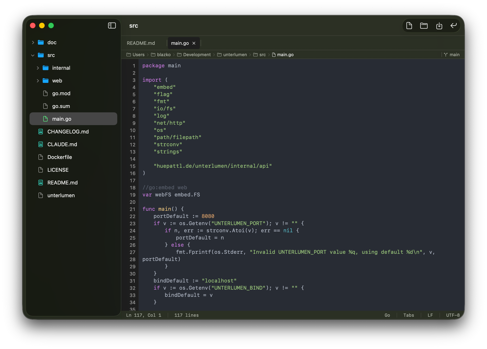
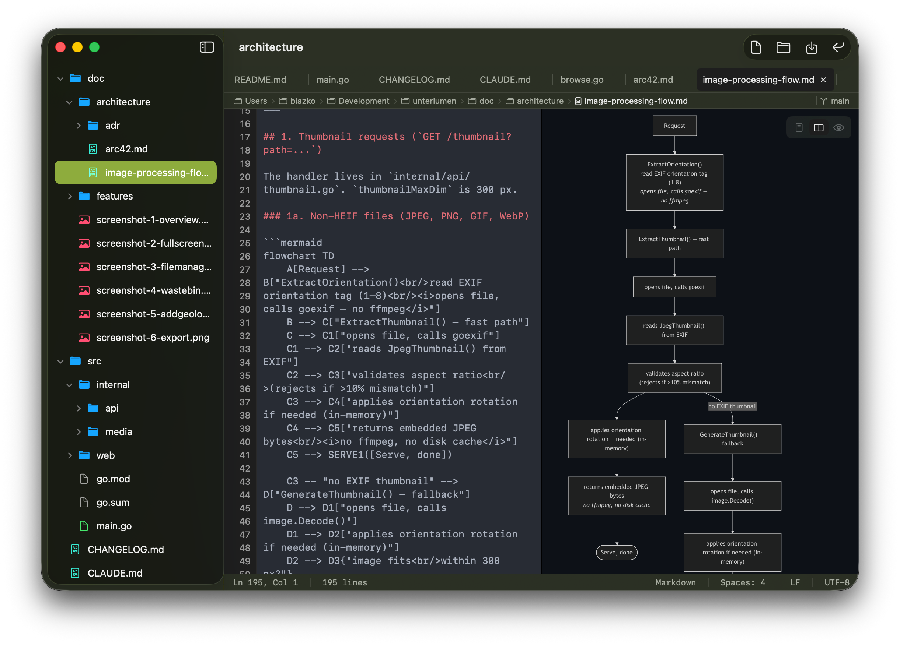

# Stuped

A native macOS code editor and file browser built with SwiftUI. Stuped offers syntax highlighting for 100+ languages, live Markdown and HTML preview with Mermaid diagram support, a file tree with real-time watching, and git branch display.

By [Hüpattl! Software](https://huepattl.de)

## Features





- **Code editing** with syntax highlighting (150+ languages via highlight.js), line numbers, and find bar
- **In-window tabs** in folder mode — each opened file gets a tab; unsaved changes are preserved per tab
- **Markdown preview** with GitHub-flavored rendering, code blocks, and Mermaid diagrams
- **HTML preview** with live rendering in a WebView
- **Image preview** for PNG, JPEG, GIF, BMP, TIFF, WebP, HEIC, and ICO files
- **Split view** for side-by-side editing and preview, toggled via a floating icon overlay (Edit / Split / Preview)
- **Live file reload** — when an external process modifies a file that is open in a tab, the editor updates immediately (unmodified tabs only; tabs with unsaved edits are left untouched)
- **File tree sidebar** with color-coded file-type icons and real-time directory watching (kqueue)
- **Path bar** with clickable breadcrumb navigation and right-click to copy path
- **Git integration** showing current branch and remote origin tooltip
- **Status bar** with cursor position, line count, indentation, line endings, and encoding
- **Dark/light mode** support throughout, including preview themes
- **Folder browsing** mode for exploring project directories
- **Global file search** (Cmd+Shift+F) — a native resizable panel that searches all files in the open folder tree by filename, contents, or both simultaneously; an inline `ext:` field narrows results to a specific file extension; results and a line-level preview are shown in a draggable split view; navigate with ↑/↓, open with Enter, dismiss with Escape
- **Reveal in File Tree** (Cmd+Shift+J) — expands and highlights the active file's node in the sidebar; useful after opening a file from search or recent files. Also accessible via right-click on any tab.
- **View Options toolbar menu** — a single `slider.horizontal.3` toolbar button opens a dropdown with all view toggles (Word Wrap, Mini-Map, Show Dot Files) and navigation shortcuts (Reveal in File Tree, Recent Files, Search Files); active toggles show a checkmark
- **Binary file detection** (null-byte scanning in first 8 KB)

## Installation

Download `Stuped.zip` from the [latest release](../../releases/latest), unzip, and move `Stuped.app` to `/Applications`.

**Gatekeeper warning on first launch**

Because Stuped is not notarized with Apple, macOS may show _"Stuped is damaged and can't be opened"_. Remove the quarantine attribute before launching:

```bash
xattr -cr /Applications/Stuped.app
```

Then double-click to open normally.

## Requirements

- macOS 15.0 or later
- Xcode 26.4 or later
- Swift 5.9

## Building

```bash
# Generate project (if using XcodeGen)
xcodegen generate

# Build from command line
xcodebuild -scheme Stuped -destination 'platform=macOS' build

# Or open in Xcode
open Stuped.xcodeproj
```

## Usage

### Opening files

- **File > Open** (Cmd+O) to open a single file in its own window
- **Double-click** a file in Finder to open it in Stuped
- **Open Folder** (Cmd+Shift+O) to browse an entire directory

### View modes

For Markdown and HTML files, a small frosted-glass icon overlay appears in the top-right corner of the editor:

- **Edit** (`doc.plaintext`) — code editor only
- **Split** (`rectangle.split.2x1`) — editor and preview side by side
- **Preview** (`eye`) — rendered preview only

Hover over each icon to see its tooltip. The overlay is hidden for plain source files and images.

### Keyboard shortcuts

| Shortcut | Action |
|----------|--------|
| Cmd+Shift+O | Open Folder |
| Cmd+R | Recent Files popup |
| Cmd+Shift+F | Open / close global file search panel |
| Cmd+1 / 2 / 3 | Switch to Edit / Split / Preview mode (previewable files only) |
| Cmd+Shift+J | Reveal active file in File Tree |
| Cmd+Shift+M | Toggle mini-map |
| Cmd+Shift+W | Toggle word wrap |
| Cmd+Shift+H | Toggle hidden files |
| Cmd+F | Find in editor |
| Cmd+Option+F | Find & Replace in editor |

### Path bar

The path bar above the editor shows the full file path. Click any component to navigate the sidebar to that directory. Right-click any component to copy its path to the clipboard.

### Git

If the current file is inside a git repository, the branch name appears at the right end of the path bar. Hover for a tooltip showing the remote origin URL.

## Documentation

- [**Changelog**](CHANGELOG.md) -- version history (keep-a-changelog format)
- [**Architecture (arc42)**](doc/arc42.md) -- system context, building blocks, runtime, deployment, quality
- [**ADR Index**](doc/adr/index.md) -- architecture decision records
- **Specifications** (`doc/spec/`):
  - [Overview](doc/spec/overview.md) -- system overview, terminology, tech stack, source layout
  - [App Lifecycle](doc/spec/app-lifecycle.md) -- scenes, launch behavior, single-file vs folder mode
  - [Document Model](doc/spec/document-model.md) -- StupedDocument, file types, binary detection
  - [Code Editor](doc/spec/code-editor.md) -- NSTextView, line numbers, highlighting, key handling
  - [Preview Rendering](doc/spec/preview-rendering.md) -- Markdown/HTML/image, WKWebView, JS libraries
  - [File Tree](doc/spec/file-tree.md) -- FileNode, FileTreeModel, directory watching
  - [Path Bar](doc/spec/path-bar.md) -- breadcrumb navigation, click handling, copy path
  - [Git Integration](doc/spec/git-integration.md) -- branch detection, remote URL
  - [Status Bar](doc/spec/status-bar.md) -- cursor, indentation, line-ending detection
  - [Language Map](doc/spec/language-map.md) -- extension-to-language mapping, preview types

## Dependencies

| Dependency | Version | Purpose |
|------------|---------|---------|
| [HighlighterSwift](https://github.com/smittytone/HighlighterSwift) | 1.0.0+ | Syntax highlighting engine |

Bundled JavaScript/CSS resources (not npm-managed):

| Resource | Purpose |
|----------|---------|
| markdown-it.min.js | Markdown parsing (CommonMark + extensions) |
| highlight.min.js | Code block syntax highlighting in preview |
| mermaid.min.js | Diagram and flowchart rendering |
| preview-styles.css | GitHub-style preview typography |
| hljs-github.css / hljs-github-dark.css | Code theme for light/dark mode |

## License

Licensed under the Apache License, Version 2.0. See [LICENSE](LICENSE) for the full text.

Copyright 2026 Hüpattl! Software (https://huepattl.de)

All dependencies use compatible open-source licenses: HighlighterSwift (MIT), highlight.js (BSD-3-Clause), markdown-it (MIT), mermaid (MIT).
