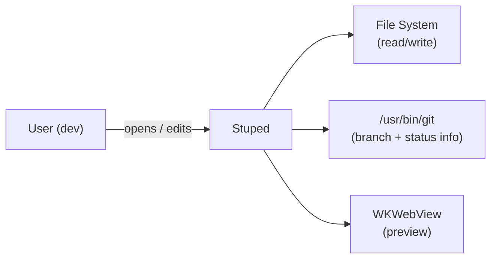
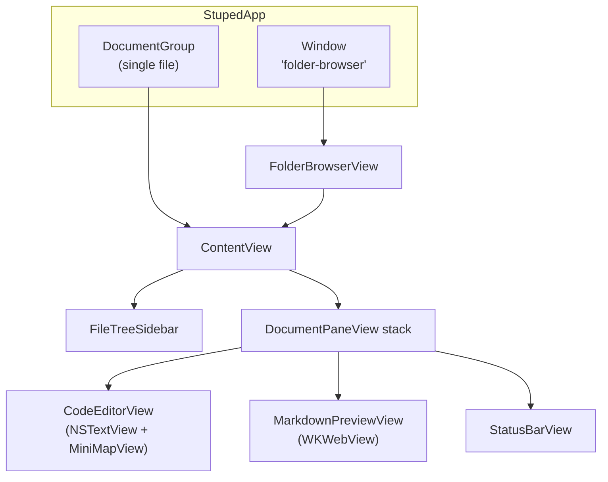
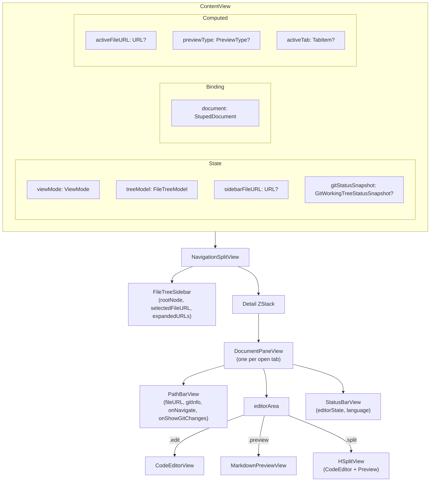
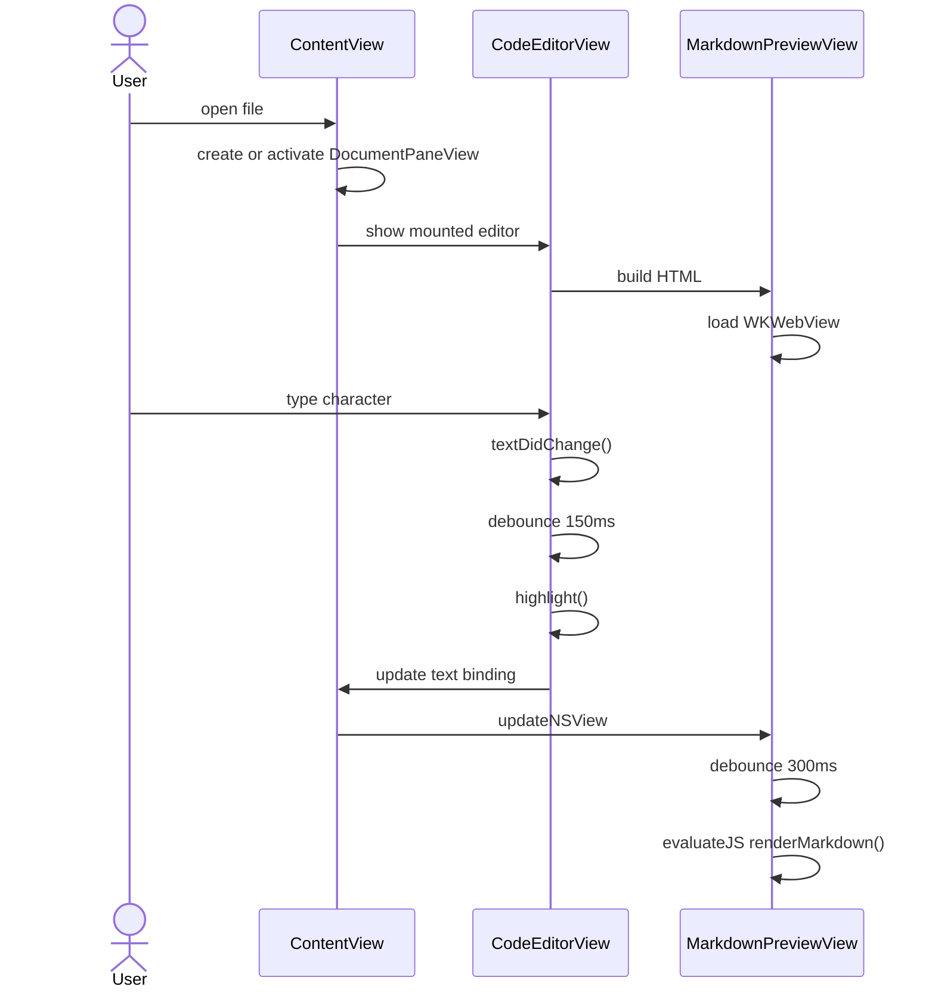
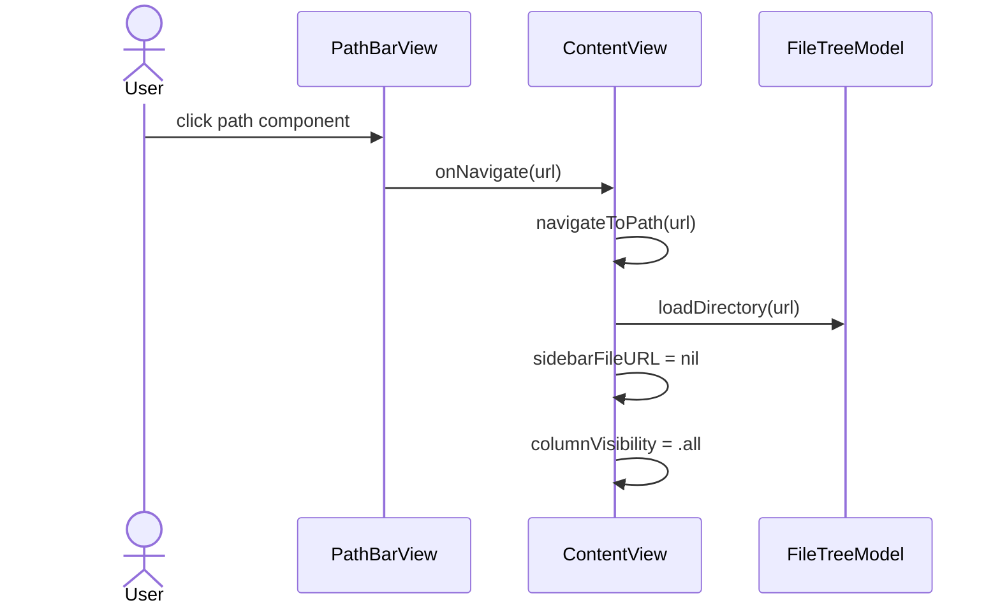
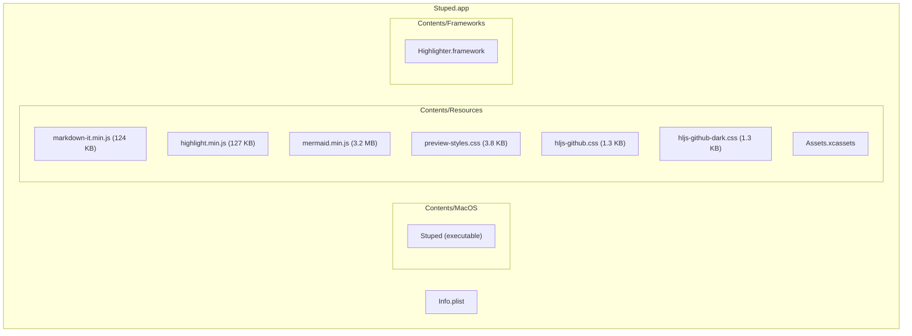
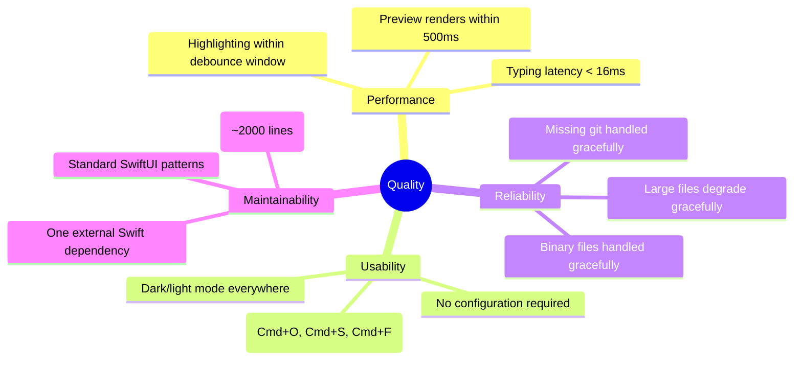

# Stuped -- Architecture Documentation (arc42)

## 1. Introduction and Goals

### Requirements Overview

Stuped is a native macOS code editor and file browser providing:

- Text editing with syntax highlighting for 100+ languages
- Live Markdown and HTML preview with Mermaid diagram support
- File tree sidebar with real-time directory watching
- In-window tab management for folder mode
- Finder-style back/forward navigation through the current folder-session's file history
- Mini-map overview panel with syntax-colour bars, selection overlay, and click-to-scroll
- Word wrap toggle (hard line breaks vs. unbounded horizontal scroll)
- Recent-files command palette (Cmd+R) seeded by the current session's file history, then macOS file history and recent folders
- Git branch and remote origin display
- Git working-tree change discovery in folder mode via file-tree decorations and a branch-click changes window
- Path bar with clickable breadcrumb navigation
- "Reveal in File Tree" (Cmd+Shift+J) to expand, scroll to, and highlight the active file in the sidebar
- View Options toolbar menu consolidating all view toggles and navigation shortcuts

### Quality Goals

| Priority | Goal | Measure |
|----------|------|---------|
| 1 | Responsiveness | Typing input latency < 16ms; highlighting/preview debounced |
| 2 | Correctness | Accurate syntax highlighting, faithful Markdown rendering |
| 3 | Simplicity | Minimal dependencies, small codebase (~2000 lines) |

### Stakeholders

| Role | Expectation |
|------|-------------|
| Developer (user) | Fast, lightweight code viewer with preview |
| Maintainer | Small, understandable codebase |

## 2. Constraints

### Technical Constraints

| Constraint | Rationale |
|------------|-----------|
| macOS 15+ | Native SwiftUI full-screen window behavior requires macOS 15; builds use Xcode 26.4 for the latest macOS SDK while preserving macOS 15 deployment |
| Swift 5.9 | Required by HighlighterSwift and Observation framework |
| No App Sandbox | Git subprocess execution and arbitrary file access |
| No network access | All resources bundled; no telemetry or updates |

### Organizational Constraints

| Constraint | Rationale |
|------------|-----------|
| Single developer | Architecture optimized for simplicity over team scaling |
| No Mac App Store | Sandbox requirement incompatible with design |

## 3. Context and Scope

### Business Context

### Technical Context

| External System | Interface | Purpose |
|-----------------|-----------|---------|
| macOS File System | `FileManager`, `open()`, `FSEventStream`, `DispatchSourceFileSystemObject` | Read/write files, directory listing, recursive tree watching, per-file open-tab watching |
| `/usr/bin/git` | `Foundation.Process` | Branch name, remote URL, repo root detection, working-tree status |
| WebKit (in-process) | `WKWebView`, `evaluateJavaScript`, `WKURLSchemeHandler` | Markdown/HTML rendering and scoped local-asset loading from preview temp staging |
| highlight.js (JavaScriptCore) | `Highlighter` (HighlighterSwift) | Editor syntax highlighting |

## 4. Solution Strategy

| Goal | Strategy |
|------|----------|
| Native feel | SwiftUI for layout; AppKit NSTextView for editing; retain one document pane per open tab and expose Finder-style toolbar history controls in folder mode |
| Rich preview | WKWebView with bundled markdown-it + mermaid.js, staging generated preview HTML under the user's temp directory and serving relative assets through a custom URL scheme |
| Responsiveness | Debounced highlighting (150ms) and preview (300ms); cached file-tree lookup maps keep large expanded sidebars from repeatedly walking the tree during render |
| File awareness | `FSEventStream` for recursive file-tree watching; kqueue/`DispatchSourceFileSystemObject` for individual open-file reloads |
| Git context | Shell out to git CLI asynchronously for branch metadata and working-tree status snapshots, with cancellation/debounce around folder-mode refresh bursts |
| Minimal footprint | One external Swift dependency; JS libs bundled as resources |

## 5. Building Block View

### Level 1: System Context

### Level 2: ContentView Internals

## 6. Runtime View

### Scenario: User opens a Markdown file and edits it

### Scenario: User clicks a path component

## 7. Deployment View

Distribution: direct download or Homebrew (not Mac App Store due to no sandbox).

## 8. Crosscutting Concepts

### Dark/Light Mode

- **Editor**: theme switches between `atom-one-dark` and `atom-one-light` via `NSApp.effectiveAppearance` observation.
- **Preview**: CSS `prefers-color-scheme: dark` media query selects code theme; Mermaid re-initializes on appearance change.
- **UI chrome**: SwiftUI `.bar` and `.secondary` colors adapt automatically.

### Debouncing

Used in two places to avoid excessive computation:

| Component | Delay | Mechanism |
|-----------|-------|-----------|
| Syntax highlighting | 150ms | `DispatchWorkItem` on main queue |
| Preview rendering | 300ms | `DispatchWorkItem` on main queue |

### Preview File Isolation

- Generated Markdown/HTML preview documents are staged under `FileManager.default.temporaryDirectory`, not beside the user's source files.
- `PreviewURLSchemeHandler` serves the staged `index.html` plus relative asset requests through `stuped-preview://preview/...`.
- Relative asset requests are allowed only when the resolved real path stays inside the active file's parent directory, preserving the previous least-privilege file-access boundary without leaving helper files in the project tree.

### Binary File Safety

Files are checked for null bytes in the first 8192 bytes before loading. Binary files show a placeholder message and are not editable.

### State Management

- `@Observable` (Observation framework) for models: `EditorState`, `FileTreeModel`, `FolderBrowserState`.
- `@State` and `@Binding` for view-local state, including pane-local viewport state inside `DocumentPaneView`.
- `NotificationCenter` for cross-window communication (folder opened notification).

## 9. Architecture Decisions

See [`doc/adr/`](adr/) for detailed Architecture Decision Records:

| ADR | Title |
|-----|-------|
| [0001](adr/0001-swiftui-with-appkit-bridging.md) | SwiftUI with AppKit Bridging |
| [0002](adr/0002-document-based-app-architecture.md) | Document-Based App Architecture |
| [0003](adr/0003-webkit-for-preview-rendering.md) | WebKit for Preview Rendering |
| [0004](adr/0004-highlighterswift-for-syntax-highlighting.md) | HighlighterSwift for Syntax Highlighting |
| [0005](adr/0005-kqueue-file-watching.md) | kqueue for File Watching |
| [0006](adr/0006-no-app-sandbox.md) | No App Sandbox |
| [0007](adr/0007-git-integration-via-process.md) | Git Integration via Process |
| [0008](adr/0008-debounced-rendering.md) | Debounced Rendering |
| [0009](adr/0009-external-script-loading-for-wkwebview.md) | External Script Loading for Large JS in WKWebView |
| [0010](adr/0010-in-window-tab-management.md) | In-Window Tab Management for Folder Mode |
| [0011](adr/0011-view-mode-overlay.md) | View Mode Switcher as In-Editor Overlay |
| [0012](adr/0012-minimap-two-pass-normalization.md) | Mini-Map Two-Pass Width Normalisation |
| [0013](adr/0013-per-tab-file-watching.md) | Per-Tab File Watching for External Change Detection |
| [0014](adr/0014-explicit-disclosure-group-for-file-tree.md) | Explicit DisclosureGroup for File Tree Expansion |
| [0015](adr/0015-fsevents-for-file-tree-watching.md) | FSEventStream for Recursive File Tree Watching |
| [0016](adr/0016-lazy-loading-for-file-tree-sidebar.md) | Lazy Loading for File Tree Sidebar |
| [0017](adr/0017-private-temp-preview-staging.md) | Private Temp Preview Staging via Custom URL Scheme |
| [0018](adr/0018-retained-per-tab-pane-instances.md) | Retained Per-Tab Pane Instances |

## 10. Quality Requirements

### Quality Tree

### Quality Scenarios

| Scenario | Measure |
|----------|---------|
| User types rapidly in a 10,000-line file | Keystrokes are never dropped; highlighting catches up within 150ms of last keystroke |
| User opens a 5 MB binary file | File is detected as binary within 1ms; placeholder shown; no crash |
| User opens a file outside any git repo | Path bar shows path without branch; no error |
| System switches from light to dark mode | Editor re-highlights with dark theme; preview re-renders with dark CSS |
| User reopens Git Changes or Find in Files after a bad autosaved frame | Panel opens at or above its enforced minimum content size; content remains visible and resizable |

## 11. Risks and Technical Debt

| Risk | Impact | Mitigation |
|------|--------|------------|
| Full file-tree rebuild on every relevant FSEvents batch | Large expanded trees can still cost CPU | URL-indexed node/children caches remove repeated lookup walks; incremental tree diffing remains a future option |
| Full re-highlight on every change | Slow for very large files | 1 MB cap; could adopt tree-sitter for incremental parsing |
| Bundled mermaid.min.js is 3.2 MB | Large app bundle | Accept; could lazy-load if bundle size becomes a concern |
| No automated tests | Regressions undetected | Add unit tests for models and UI tests for key flows |
| `Process.waitUntilExit()` blocks thread | Thread pool starvation under heavy git churn | Current folder-mode status refreshes are cancelled/debounced; could still move to a fully async `Process` API later |

## 12. Glossary

| Term | Definition |
|------|------------|
| DocumentGroup | SwiftUI scene type for document-based apps |
| FileDocument | Protocol for reading/writing file contents |
| NSViewRepresentable | Protocol for wrapping AppKit views in SwiftUI |
| Coordinator | Object mediating between SwiftUI and AppKit delegates |
| FSEvents | macOS recursive file-system event stream API |
| kqueue | macOS kernel event notification mechanism |
| DispatchSource | GCD wrapper used here for per-file open-tab monitoring |
| markdown-it | JavaScript library for parsing Markdown to HTML |
| highlight.js | JavaScript library for syntax highlighting |
| Mermaid | JavaScript library for rendering diagrams from text |
| HighlighterSwift | Swift package wrapping highlight.js via JavaScriptCore |
| PreviewType | Enum (`.markdown`, `.html`, `.image`) controlling preview rendering path |
| ViewMode | Enum (`.edit`, `.preview`, `.split`) controlling editor layout |
