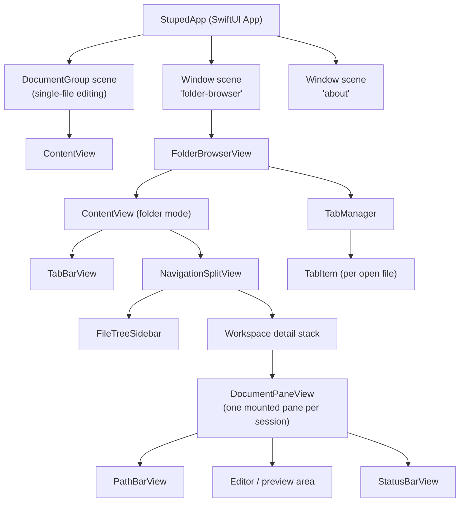

# Specification: System Overview

## Purpose

Stuped is a native macOS application for viewing and editing text-based files with syntax highlighting and live preview capabilities. It targets developers who want a lightweight editor with Markdown/HTML preview, file tree browsing, and lightweight git context including working-tree change discovery.

## Terminology

| Term | Definition |
|------|------------|
| Single-file mode | App opened via Finder or File > Open; one document per window |
| Folder mode | App opened via Open Folder (Cmd+Shift+O); sidebar-driven browsing |
| Active file | The file currently loaded in the editor (`activeFileURL`) |
| Previewable | A file whose extension maps to a `PreviewType` (Markdown or HTML) |
| View mode | One of Edit, Preview, or Split |
| Dotfile | A file or directory whose name starts with `.`; hidden by default, shown via ⌘⇧H |

## High-Level Architecture



## Data Flow

1. **File selection** flows from `FileTreeSidebar` → `onFileSelected` callback → `TabManager.open(url:)` which loads the file (if new) or switches to the existing tab. The active tab's text is bound back to `ContentView` via `FolderBrowserView.activeDocumentBinding`.
2. **Session history navigation** is owned by `TabManager`, which records a linear file history for the current folder session. Folder-mode toolbar Back / Forward buttons call `goBack()` / `goForward()` to switch tabs or reopen files that were closed later.
3. **Tab switching** is signalled by the `.stupedTabSwitched` notification. `ContentView` receives it to update the sidebar highlight and switch which already-mounted `DocumentPaneView` is visible, so the tab's live editor/preview context remains intact without re-reading the file from disk.
4. **Reveal in File Tree** is triggered by the `.stupedRevealInFileTree` notification (optionally carrying a `"url"` key). `ContentView` routes the request through `FileTreeModel.reveal(_:)`, which expands ancestor folders and records the target row for the sidebar. `FileTreeSidebar` then scrolls that row into view, while `ContentView` sets `sidebarFileURL` and `columnVisibility = .all`.
5. **Copy Path** actions in tab and file-tree context menus derive name-only, project-relative, and absolute clipboard strings from the selected URL. Relative paths are always based on `FolderBrowserState.folderURL`, even if the sidebar is currently narrowed to a subfolder.
6. **Text editing** flows from `NSTextView` through the `Coordinator` delegate back to `document.text` → `TabManager.activeTab.text`, marking the tab dirty (`isDirty = true`).
7. **Saving** writes `document.text` to `sidebarFileURL`; the `onFileSaved` callback clears the tab's dirty flag.
8. **Git info** is fetched asynchronously via `Process` inside each `DocumentPaneView` and displayed by its `PathBarView`.
9. **Git working-tree status** is fetched asynchronously in folder mode and shared across the sidebar decorations and the Git Changes window.
10. **File tree updates** are triggered by kqueue file system events, which rebuild the `FileTreeModel.rootNode` tree.

## Technology Stack

| Layer | Technology |
|-------|------------|
| UI framework | SwiftUI (macOS 15+) |
| Text editor | AppKit NSTextView via NSViewRepresentable |
| Preview | WebKit WKWebView via NSViewRepresentable |
| Syntax highlighting | HighlighterSwift (highlight.js wrapper) |
| Markdown parsing | markdown-it.min.js (bundled) |
| Diagrams | mermaid.min.js (bundled) |
| File watching | Darwin kqueue via DispatchSource |
| Git | /usr/bin/git via Foundation Process |
| State management | Observation framework (@Observable) |

## Source Layout

```
Stuped/
  StupedApp.swift              App entry point, scenes, AppDelegate, FolderBrowserState
  Models/
    StupedDocument.swift        FileDocument conformance
    EditorState.swift           Cursor, indentation, line endings
    FileNode.swift              File tree node (iconName, iconColor)
    FileTreeModel.swift         Directory loading and watching
    GitCLI.swift                Shared git subprocess runner and repo helpers
    GitInfo.swift               Async git info fetcher
    GitWorkingTreeStatus.swift  Working-tree status snapshot and parser
    LanguageMap.swift           Extension-to-language mapping, PreviewType
    RecentFoldersStore.swift    Persisted recent-folder history for folder mode
    TabItem.swift               Per-tab state (fileURL, text, dirty tracking, view mode)
    TabManager.swift            Tab list management, file loading, and session history
  Views/
    AboutView.swift             Custom About dialog
    ContentView.swift           Workspace layout, toolbar, pane visibility coordination
    DocumentPaneView.swift      Retained per-document pane with path bar, editor/preview, status bar
    FolderBrowserView.swift     Folder-browser window wrapper, owns TabManager
    GitChangesPopupView.swift   Native grouped list of working-tree changes
    GitChangesWindowManager.swift
    PathBarView.swift           Breadcrumb path bar with git branch; folder-mode history buttons stay in the native toolbar
    StatusBarView.swift         Bottom metadata bar
    TabBarView.swift            Horizontal tab strip for folder mode
    RecentFilesPopupView.swift  Cmd+R floating recent-items popup (files + folders)
    Editor/
      CodeEditorView.swift      NSTextView wrapper with highlighting, word wrap, mini-map wiring
      LineNumberGutterView.swift Line number gutter
      MiniMapView.swift         Scaled document overview panel (right edge, 80pt)
    Preview/
      MarkdownPreviewView.swift WKWebView wrapper for Markdown/HTML
      PreviewFileAccess.swift   Preview temp-store + custom URL scheme handler
      ImagePreviewView.swift    Image viewer with metadata overlay
    Sidebar/
      FileTreeSidebar.swift     Hierarchical file list with colored icons
  Resources/
    markdown-it.min.js
    highlight.min.js
    mermaid.min.js
    preview-styles.css
    hljs-github.css
    hljs-github-dark.css
    preview-template.html       (reference only, not loaded at runtime)
```
