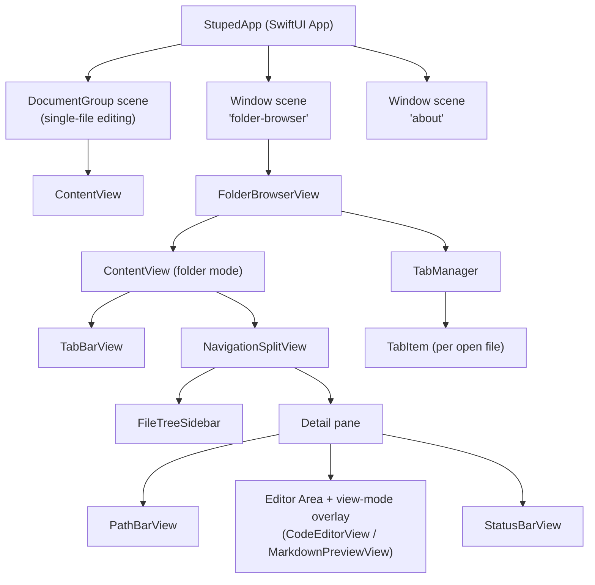

# Specification: System Overview

## Purpose

Stuped is a native macOS application for viewing and editing text-based files with syntax highlighting and live preview capabilities. It targets developers who want a lightweight editor with Markdown/HTML preview, file tree browsing, and basic git context.

## Terminology

| Term | Definition |
|------|------------|
| Single-file mode | App opened via Finder or File > Open; one document per window |
| Folder mode | App opened via Open Folder (Cmd+Shift+O); sidebar-driven browsing |
| Active file | The file currently loaded in the editor (`activeFileURL`) |
| Previewable | A file whose extension maps to a `PreviewType` (Markdown or HTML) |
| View mode | One of Edit, Preview, or Split |
| Dotfile | A file or directory whose name starts with `.`; hidden by default, shown via ⌘⇧H |

## High-Level Architecture



## Data Flow

1. **File selection** flows from `FileTreeSidebar` → `onFileSelected` callback → `TabManager.open(url:)` which loads the file (if new) or switches to the existing tab. The active tab's text is bound back to `ContentView` via `FolderBrowserView.activeDocumentBinding`.
2. **Tab switching** is signalled by the `.stupedTabSwitched` notification. `ContentView` receives it to update the sidebar highlight and infer the correct view mode without re-reading the file from disk.
3. **Reveal in File Tree** is triggered by the `.stupedRevealInFileTree` notification (optionally carrying a `"url"` key). `ContentView` calls `FileTreeModel.expandToURL(_:)` to populate `expandedURLs`, then sets `sidebarFileURL` and `columnVisibility = .all`.
4. **Text editing** flows from `NSTextView` through the `Coordinator` delegate back to `document.text` → `TabManager.activeTab.text`, marking the tab dirty (`isDirty = true`).
5. **Saving** writes `document.text` to `sidebarFileURL`; the `onFileSaved` callback clears the tab's dirty flag.
6. **Git info** is fetched asynchronously via `Process` when the active file changes, stored in `@State gitInfo`, and displayed by `PathBarView`.
7. **File tree updates** are triggered by kqueue file system events, which rebuild the `FileTreeModel.rootNode` tree.

## Technology Stack

| Layer | Technology |
|-------|------------|
| UI framework | SwiftUI (macOS 15+) |
| Text editor | AppKit NSTextView via NSViewRepresentable |
| Preview | WebKit WKWebView via NSViewRepresentable |
| Syntax highlighting | HighlighterSwift (highlight.js wrapper) |
| Markdown parsing | markdown-it.min.js (bundled) |
| Diagrams | mermaid.min.js (bundled) |
| File watching | Darwin kqueue via DispatchSource |
| Git | /usr/bin/git via Foundation Process |
| State management | Observation framework (@Observable) |

## Source Layout

```
Stuped/
  StupedApp.swift              App entry point, scenes, AppDelegate, FolderBrowserState
  Models/
    StupedDocument.swift        FileDocument conformance
    EditorState.swift           Cursor, indentation, line endings
    FileNode.swift              File tree node (iconName, iconColor)
    FileTreeModel.swift         Directory loading and watching
    GitInfo.swift               Async git info fetcher
    LanguageMap.swift           Extension-to-language mapping, PreviewType
    TabItem.swift               Per-tab state (fileURL, text, dirty tracking)
    TabManager.swift            Tab list management and file loading
  Views/
    AboutView.swift             Custom About dialog
    ContentView.swift           Main layout, toolbar, coordination
    FolderBrowserView.swift     Folder-browser window wrapper, owns TabManager
    PathBarView.swift           Breadcrumb path bar with git branch
    StatusBarView.swift         Bottom metadata bar
    TabBarView.swift            Horizontal tab strip for folder mode
    RecentFilesPopupView.swift  Cmd+R floating recent-files popup (folder mode)
    Editor/
      CodeEditorView.swift      NSTextView wrapper with highlighting, word wrap, mini-map wiring
      LineNumberGutterView.swift Line number gutter
      MiniMapView.swift         Scaled document overview panel (right edge, 80pt)
    Preview/
      MarkdownPreviewView.swift WKWebView wrapper for Markdown/HTML
      ImagePreviewView.swift    Image viewer with metadata overlay
    Sidebar/
      FileTreeSidebar.swift     Hierarchical file list with colored icons
  Resources/
    markdown-it.min.js
    highlight.min.js
    mermaid.min.js
    preview-styles.css
    hljs-github.css
    hljs-github-dark.css
    preview-template.html       (reference only, not loaded at runtime)
```
