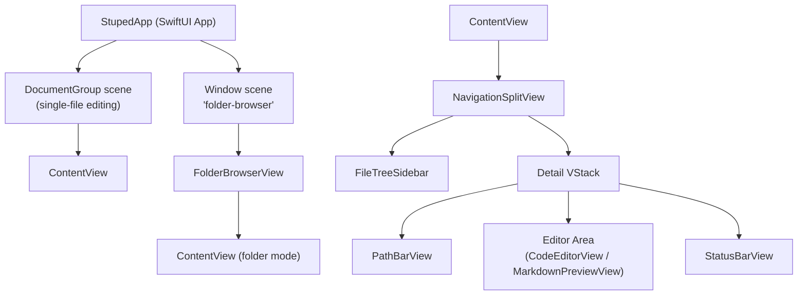

# Specification: System Overview

## Purpose

Stuped is a native macOS application for viewing and editing text-based files with syntax highlighting and live preview capabilities. It targets developers who want a lightweight editor with Markdown/HTML preview, file tree browsing, and basic git context.

## Terminology

| Term | Definition |
|------|------------|
| Single-file mode | App opened via Finder or File > Open; one document per window |
| Folder mode | App opened via Open Folder (Cmd+Shift+O); sidebar-driven browsing |
| Active file | The file currently loaded in the editor (`activeFileURL`) |
| Previewable | A file whose extension maps to a `PreviewType` (Markdown or HTML) |
| View mode | One of Edit, Preview, or Split |

## High-Level Architecture



## Data Flow

1. **File selection** flows from `FileTreeSidebar` through `sidebarFileURL` (@State) to `ContentView`, which loads the file into `StupedDocument.text` (@Binding).
2. **Text editing** flows from `NSTextView` through the `Coordinator` delegate back to `document.text`, triggering debounced syntax highlighting and preview updates.
3. **Git info** is fetched asynchronously via `Process` when the active file changes, stored in `@State gitInfo`, and displayed by `PathBarView`.
4. **File tree updates** are triggered by kqueue file system events, which rebuild the `FileTreeModel.rootNode` tree.

## Technology Stack

| Layer | Technology |
|-------|------------|
| UI framework | SwiftUI (macOS 15+) |
| Text editor | AppKit NSTextView via NSViewRepresentable |
| Preview | WebKit WKWebView via NSViewRepresentable |
| Syntax highlighting | HighlighterSwift (highlight.js wrapper) |
| Markdown parsing | markdown-it.min.js (bundled) |
| Diagrams | mermaid.min.js (bundled) |
| File watching | Darwin kqueue via DispatchSource |
| Git | /usr/bin/git via Foundation Process |
| State management | Observation framework (@Observable) |

## Source Layout

```
Stuped/
  StupedApp.swift              App entry point, scenes, AppDelegate
  Models/
    StupedDocument.swift        FileDocument conformance
    EditorState.swift           Cursor, indentation, line endings
    FileNode.swift              File tree node
    FileTreeModel.swift         Directory loading and watching
    GitInfo.swift               Async git info fetcher
    LanguageMap.swift            Extension-to-language mapping, PreviewType
  Views/
    ContentView.swift           Main layout, toolbar, coordination
    FolderBrowserView.swift     Folder-browser window wrapper
    PathBarView.swift           Breadcrumb path bar with git branch
    StatusBarView.swift         Bottom metadata bar
    Editor/
      CodeEditorView.swift      NSTextView wrapper with highlighting
      LineNumberGutterView.swift Line number gutter
    Preview/
      MarkdownPreviewView.swift WKWebView wrapper for Markdown/HTML
    Sidebar/
      FileTreeSidebar.swift     Hierarchical file list
  Resources/
    markdown-it.min.js
    highlight.min.js
    mermaid.min.js
    preview-styles.css
    hljs-github.css
    hljs-github-dark.css
    preview-template.html       (reference only, not loaded at runtime)
```
