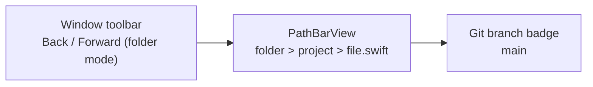

# Specification: Path Bar

## File: `Stuped/Views/PathBarView.swift`

## Overview

A horizontal bar above the editor showing the full file path as clickable breadcrumb components, plus the git branch name. In folder mode, Finder-style Back / Forward controls live in the native window toolbar, while the path bar itself remains focused on breadcrumb navigation and git context.

## Parameters

| Parameter | Type | Description |
|-----------|------|-------------|
| `fileURL` | `URL?` | Path to display |
| `projectRootURL` | `URL?` | Originally opened project root used for relative-path copy actions |
| `gitInfo` | `GitInfo?` | Git branch and remote info |
| `onNavigate` | `((URL) -> Void)?` | Callback when a path component is clicked |

## Layout

### Left section: path components

- `url.pathComponents` is filtered to remove the root `"/"` element.
- Each component is a `Button` with `.buttonStyle(.plain)`.
- Components are separated by chevron-right icons (`chevron.right`, 8pt semibold, quaternary color).
- Each component shows an icon + name:
  - Directories: `folder` icon, `.secondary` color.
  - Last component (file): type-specific icon, `.primary` color.
- Font: system 11pt.
- Wrapped in a horizontal `ScrollView` (no scroll indicators).
- Auto-scrolls to the last component (`ScrollViewReader` with id `"last"`).
- Hover cursor: `NSCursor.pointingHand`.

### Right section: git branch

- Only shown when `gitInfo?.branchName` is non-nil.
- Separated by a `Divider` (12pt height).
- Icon: `arrow.triangle.branch` (10pt, secondary).
- Text: branch name (11pt, secondary, single line).
- Tooltip (`.help`): `gitInfo?.remoteURL ?? "No remote configured"`.

## Relationship to folder-mode history controls

- Folder mode adds Finder-style Back / Forward buttons in `ContentView.toolbarContent` using `ToolbarItemGroup(placement: .navigation)`.
- Those buttons operate on `TabManager`'s linear per-session file history and can switch to an already-open tab or reopen a file whose tab was closed.
- The path bar does not own that history state; it continues to expose only breadcrumb navigation through `onNavigate`.

## Styling

| Property | Value |
|----------|-------|
| Vertical padding | 4pt |
| Horizontal padding (path) | 12pt |
| Background | `.bar` |
| Bottom edge | `Divider()` overlay |

## File Icon Logic

| Extension | Icon |
|-----------|------|
| Markdown extensions | `doc.richtext` |
| `html`, `htm`, `xhtml` | `globe` |
| Image extensions | `photo` |
| Everything else | `doc` |

## Context Menu

Each breadcrumb component has a right-click context menu with the shared **Copy Path** submenu used by tabs and the file tree:

- **Name Only** — copies `lastPathComponent` for the clicked breadcrumb target
- **Relative to Project Root** — copies the path relative to the originally opened project root when the target is inside that root
- **Full Path** — copies the absolute path from root up to and including the clicked component

The breadcrumb target path is built by `buildPath(componentIndex:fullURL:)`.

## Navigation Callback

When a component is clicked:

1. The component index (0-based, relative to the filtered array) is mapped to the full `pathComponents` array (offset by 1 to skip `"/"`).
2. A path string is reconstructed from root to the clicked component.
3. `onNavigate?(URL(fileURLWithPath: path))` is called.

In `ContentView`, the callback calls `navigateToPath(_:)`:

- **Directory**: loads it in the sidebar tree, clears file selection, shows sidebar.
- **File**: loads the parent directory in the tree, selects the file, shows sidebar.
